# Specification: light-page Reader Mode & Theme Reliability Refactor (v1)

## 1. Formal Requirement Restatement

### Goal:

Make the reader-mode extraction and theme application in `light-page` deterministic, persistent across navigation and reload, and resilient to page structure variations, while preserving the existing single-WebView architecture and providing a status screen that reports live browser UI state during page loads.

### Scope In:

- Replace the inverted boolean theme flag with an explicit `PageTheme` enum.
- Move all CSS/JS injection lifecycle into `LightWebViewClient` so that theme and reader state are re-applied on every navigation, reload, and history change.
- Inject base theme CSS at `onPageStarted` to eliminate white flashes and inconsistent application.
- Add retry, eligibility checks, and structured error reporting to the Readability-based reader mode.
- Persist theme and reader preferences across app restarts via `ReaderPreferences`.
- Update the JavaScript page hooks to report both success and failure, and to never leave the page in a broken intermediate state.
- Add a `StatusScreen` that displays the current `BrowserUiState` while a page is loading.
- Remove the default URL; when no URL is provided, display a "Tap to open drawer" prompt instead of loading a page.
- Add exhaustive unit, integration, and invariant tests.

### Scope Out:

- Server-side article extraction.
- Native browser reader mode integration.
- Multi-WebView or headless-extraction architecture (kept as future work).
- Rewriting the entire UI or navigation model.

### Actors:

- `User` — toggles reader mode, theme, and navigates.
- `BrowserScreen` — Compose UI hosting the WebView and status overlay.
- `StatusScreen` — overlay that reports live `BrowserUiState` during loading.
- `BrowserViewModel` — holds `BrowserUiState` and persists preferences.
- `LightWebViewClient` — WebView lifecycle owner for injection and state reporting.
- `PageInjector` — loads and injects CSS/JS assets.
- `page-hooks.js` — in-page coordinator for theme and reader mode.
- `Readability.js` — Mozilla article extraction library.
- `DOMPurify` — HTML sanitization library.
- `ReaderPreferences` — DataStore-backed persistence.

### Invariants:

- `INV-THEME-1`: The selected `PageTheme` must be applied to the WebView before the first paint of every page load.
- `INV-THEME-2`: Theme state must survive WebView reload, configuration change, and app restart.
- `INV-READER-1`: Reader mode must always be reversible; the original DOM must be restorable.
- `INV-READER-2`: If reader mode cannot be applied, the app must report a structured reason and leave the original page visible.
- `INV-STATE-1`: Kotlin state changes must be reflected in the WebView within one UI frame.
- `INV-STATE-2`: The WebView must never be the source of truth for theme or reader preferences.
- `INV-NO-DEFAULT`: No page may be loaded unless the user explicitly provides or selects a URL.
- `INV-STATUS-1`: The status screen must be visible whenever `BrowserUiState.loading` is `true`.
- `INV-STATUS-2`: The status screen must accurately reflect the current `BrowserUiState` fields at all times while visible.

---

## 2. Data Model

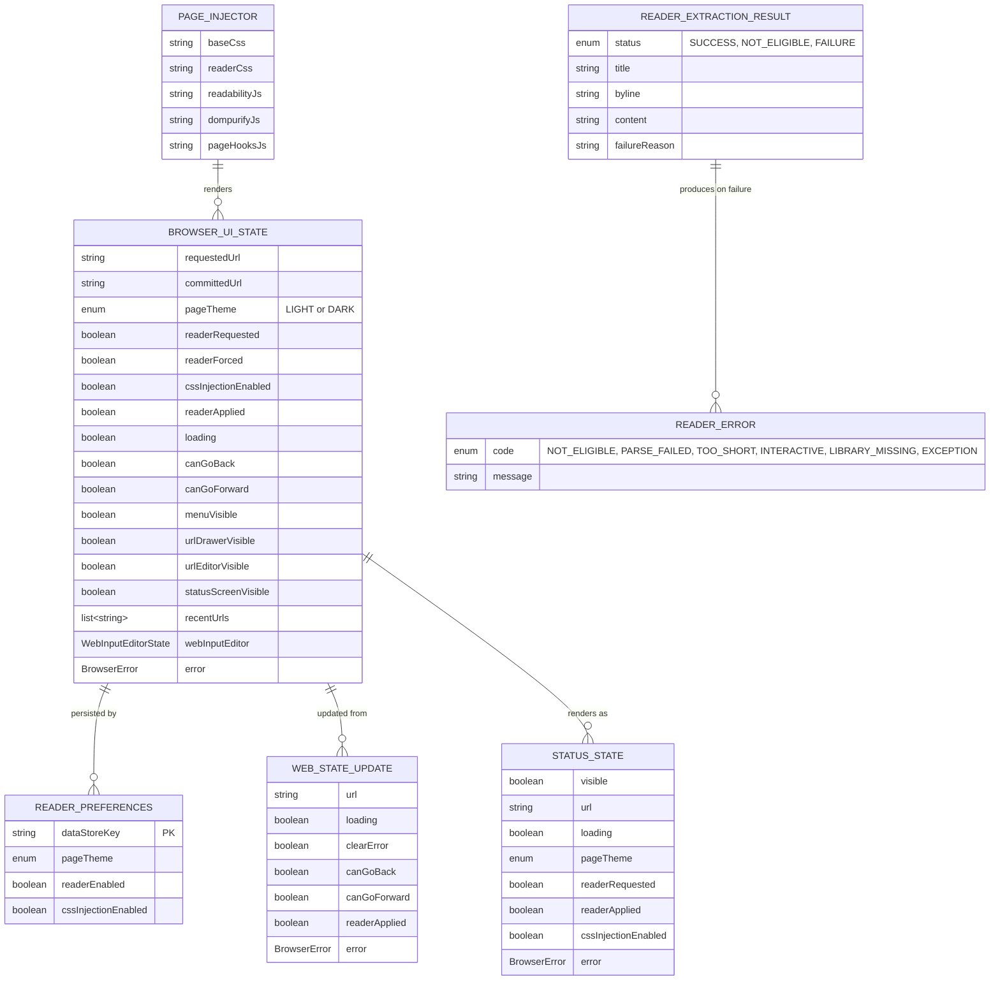

### Field definitions:

| Entity             | Field               | Type          | Constraints | Description                                               |
| ------------------ | ------------------- | ------------- | ----------- | --------------------------------------------------------- |
| BROWSER_UI_STATE   | requestedUrl        | string        | NOT NULL    | URL the user asked to load; empty when no URL provided.   |
| BROWSER_UI_STATE   | committedUrl        | string?       | nullable    | URL reported by the WebView after navigation.             |
| BROWSER_UI_STATE   | pageTheme           | enum          | NOT NULL    | `LIGHT` or `DARK`; replaces `themeInverted`.              |
| BROWSER_UI_STATE   | readerRequested     | boolean       | NOT NULL    | User wants reader mode when possible.                     |
| BROWSER_UI_STATE   | readerForced        | boolean       | NOT NULL    | User has explicitly toggled reader mode on this session.  |
| BROWSER_UI_STATE   | cssInjectionEnabled | boolean       | NOT NULL    | Whether custom CSS injection is active.                   |
| BROWSER_UI_STATE   | readerApplied       | boolean       | NOT NULL    | Last reported state from JS bridge.                       |
| BROWSER_UI_STATE   | loading             | boolean       | NOT NULL    | True between `onPageStarted` and `onPageFinished`.        |
| BROWSER_UI_STATE   | canGoBack           | boolean       | NOT NULL    | Derived from `WebView.canGoBack()`.                       |
| BROWSER_UI_STATE   | canGoForward        | boolean       | NOT NULL    | Derived from `WebView.canGoForward()`.                    |
| BROWSER_UI_STATE   | statusScreenVisible | boolean       | NOT NULL    | True when `loading` is true or when explicitly requested. |
| BROWSER_UI_STATE   | error               | BrowserError? | nullable    | Transient error surfaced to the user and status screen.   |
| READER_PREFERENCES | dataStoreKey        | string        | PK          | Fixed key for DataStore preferences.                      |
| READER_PREFERENCES | pageTheme           | enum          | NOT NULL    | Persisted theme.                                          |
| READER_PREFERENCES | readerEnabled       | boolean       | NOT NULL    | Persisted reader default.                                 |
| READER_PREFERENCES | cssInjectionEnabled | boolean       | NOT NULL    | Persisted CSS injection default.                          |
| WEB_STATE_UPDATE   | url                 | string?       | nullable    | URL from WebView callback.                                |
| WEB_STATE_UPDATE   | loading             | boolean?      | nullable    | Optional loading flag.                                    |
| WEB_STATE_UPDATE   | clearError          | boolean?      | nullable    | True when a new navigation starts.                        |
| WEB_STATE_UPDATE   | readerApplied       | boolean?      | nullable    | Reported by JS bridge.                                    |
| WEB_STATE_UPDATE   | error               | BrowserError? | nullable    | Error to display.                                         |
| STATUS_STATE       | visible             | boolean       | NOT NULL    | Mirrors `BrowserUiState.statusScreenVisible`.             |
| STATUS_STATE       | url                 | string        | NOT NULL    | Mirrors `BrowserUiState.requestedUrl` or `committedUrl`.  |
| STATUS_STATE       | loading             | boolean       | NOT NULL    | Mirrors `BrowserUiState.loading`.                         |
| STATUS_STATE       | pageTheme           | enum          | NOT NULL    | Mirrors `BrowserUiState.pageTheme`.                       |
| STATUS_STATE       | readerRequested     | boolean       | NOT NULL    | Mirrors `BrowserUiState.readerRequested`.                 |
| STATUS_STATE       | readerApplied       | boolean       | NOT NULL    | Mirrors `BrowserUiState.readerApplied`.                   |
| STATUS_STATE       | cssInjectionEnabled | boolean       | NOT NULL    | Mirrors `BrowserUiState.cssInjectionEnabled`.             |
| STATUS_STATE       | error               | BrowserError? | nullable    | Mirrors `BrowserUiState.error`.                           |

---

## 3. Code Architecture

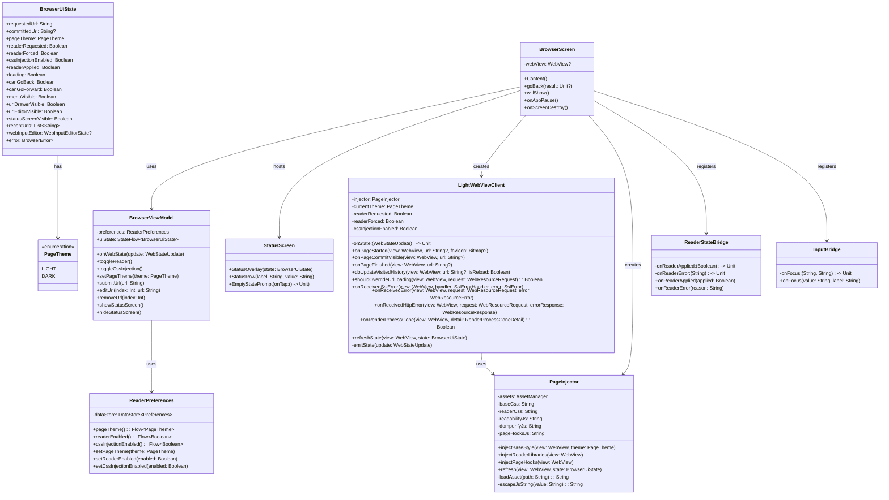

### Module boundaries:

| Component              | Responsibility                                                                                                               | Owned By           |
| ---------------------- | ---------------------------------------------------------------------------------------------------------------------------- | ------------------ |
| `BrowserScreen`        | Compose UI, WebView creation, bridge registration, lifecycle callbacks, hosts `StatusScreen`.                                | UI layer           |
| `StatusScreen`         | Renders live `BrowserUiState` during loading and the empty-state prompt when no URL is set.                                  | UI layer           |
| `BrowserViewModel`     | Holds `BrowserUiState`, persists preferences, processes user intents and WebView state updates.                              | Presentation layer |
| `ReaderPreferences`    | DataStore read/write for theme, reader, and CSS injection defaults.                                                          | Data layer         |
| `LightWebViewClient`   | All WebView lifecycle callbacks; owns injection timing and forwards state updates.                                           | WebView layer      |
| `PageInjector`         | Loads assets from `AssetManager` and evaluates them into the WebView.                                                        | WebView layer      |
| `ReaderStateBridge`    | Receives reader applied/error events from JavaScript and forwards to Kotlin.                                                 | Bridge layer       |
| `InputBridge`          | Receives focused input events from JavaScript and forwards to Kotlin.                                                        | Bridge layer       |
| `page-hooks.js`        | In-page coordinator: theme class toggling, reader eligibility, Readability invocation, retry, fallback, shadow-root theming. | Assets             |
| `light-page-theme.css` | Base CSS variables and overrides for light/dark modes.                                                                       | Assets             |
| `reader-theme.css`     | Reader-only layout and typography styles.                                                                                    | Assets             |

---

## 4. Component Interactions

### 4.1 Initial Launch with No Default URL

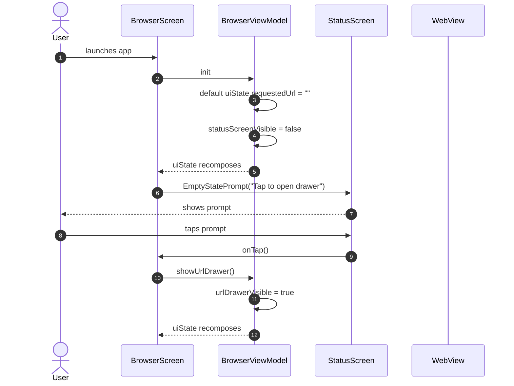

#### Preconditions:

- App is launched with no saved URL or deeplink.
- `ReaderPreferences` may contain theme/reader defaults but no URL.

#### Postconditions:

- WebView remains empty; no network request is made.
- URL drawer is shown for user input.

### 4.2 Navigation with Deterministic Theme Injection and Status Reporting

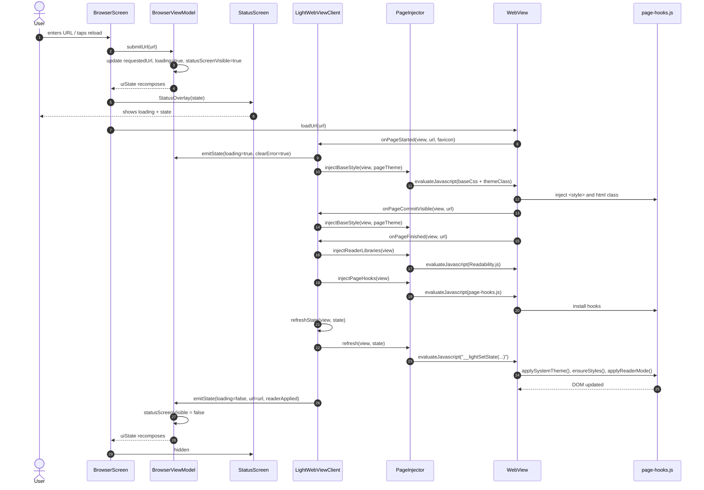

### Preconditions:

- `BrowserUiState.requestedUrl` is non-blank and allowed by `BrowserPolicy`.
- `PageInjector` has loaded all asset files into memory.

### Postconditions:

- Base theme CSS is present before first paint.
- Reader libraries and hooks are installed after `onPageFinished`.
- Status screen is visible during loading and hidden when loading completes.
- `BrowserUiState.committedUrl` equals the loaded URL.
- `BrowserUiState.loading` is false.

### 4.3 Reader Mode Extraction with Retry and Fallback

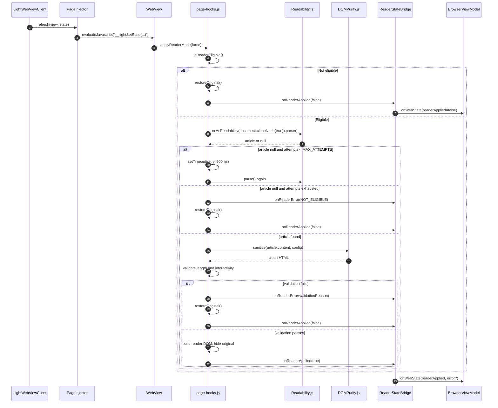

### Preconditions:

- `page-hooks.js` is installed.
- `Readability.js` and `DOMPurify.js` are installed.
- `BrowserUiState.readerRequested` is true.

### Postconditions:

- Either the reader DOM is applied and `readerApplied=true`, or the original DOM is restored and a structured error is reported.

### 4.4 User Toggles Theme

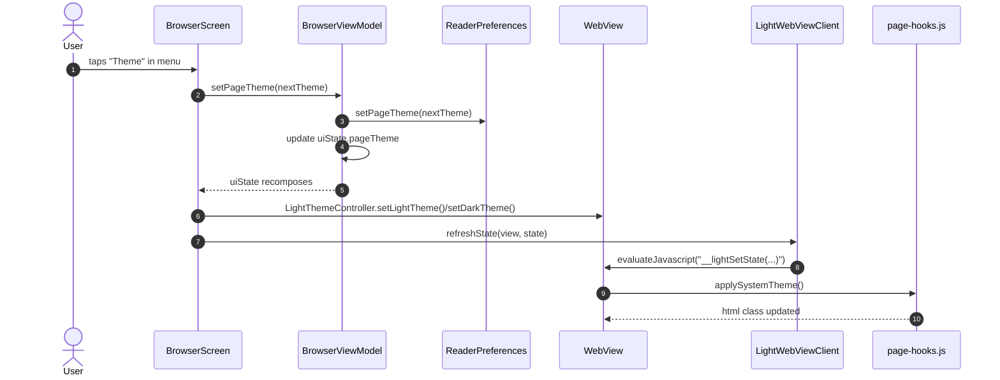

### Preconditions:

- WebView is attached and `page-hooks.js` is installed.

### Postconditions:

- Compose UI theme matches WebView theme.
- `html.__light_dark_mode` class reflects the selected theme.
- Preference is persisted.

---

## 5. Stateful Behavior

### 5.1 PageTheme

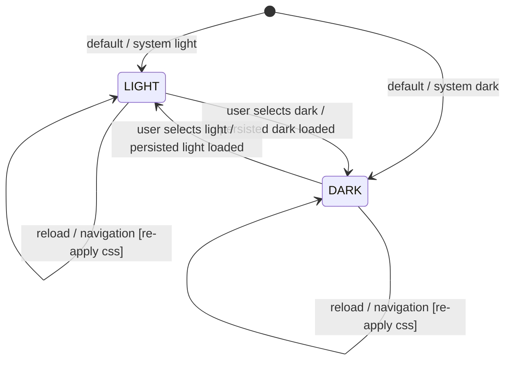

### Transition table:

| From    | To      | Trigger                            | Guard                   | Action                                                                          |
| ------- | ------- | ---------------------------------- | ----------------------- | ------------------------------------------------------------------------------- |
| `LIGHT` | `DARK`  | `setPageTheme(DARK)`               | none                    | Persist `DARK`; call `LightThemeController.setDarkTheme()`; inject dark CSS.    |
| `DARK`  | `LIGHT` | `setPageTheme(LIGHT)`              | none                    | Persist `LIGHT`; call `LightThemeController.setLightTheme()`; inject light CSS. |
| `LIGHT` | `LIGHT` | `onPageStarted` / `onPageFinished` | `currentTheme == LIGHT` | Re-inject `light-page-theme.css` with light variables.                          |
| `DARK`  | `DARK`  | `onPageStarted` / `onPageFinished` | `currentTheme == DARK`  | Re-inject `light-page-theme.css` with dark variables.                           |

### 5.2 ReaderMode

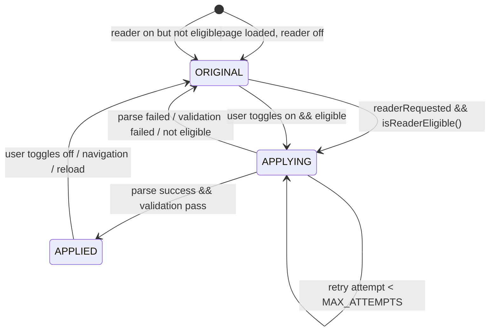

### Transition table:

| From       | To         | Trigger                                        | Guard                                                                                | Action                                                                         |
| ---------- | ---------- | ---------------------------------------------- | ------------------------------------------------------------------------------------ | ------------------------------------------------------------------------------ |
| `ORIGINAL` | `APPLYING` | `__lightToolRefresh`                           | `readerRequested && isReaderEligible()`                                              | Clone DOM, run Readability.                                                    |
| `APPLYING` | `APPLYING` | `setTimeout` retry                             | `attempts < MAX_ATTEMPTS` && previous parse null                                     | Wait 500ms, re-run parse.                                                      |
| `APPLYING` | `APPLIED`  | Readability returns article                    | `cleanText.length >= MIN_PROSE_LENGTH` && `!hasSignificantInteractiveContent(clean)` | Build reader DOM, hide original, report `readerApplied=true`.                  |
| `APPLYING` | `ORIGINAL` | Readability fails after max attempts           | `attempts >= MAX_ATTEMPTS`                                                           | Report `ReaderError.NOT_ELIGIBLE`, restore original.                           |
| `APPLYING` | `ORIGINAL` | Validation fails                               | `cleanText < MIN_PROSE_LENGTH` or interactive content dominant                       | Report `ReaderError.TOO_SHORT` or `ReaderError.INTERACTIVE`, restore original. |
| `APPLIED`  | `ORIGINAL` | `__lightSetReaderEnabled(false)` or navigation | none                                                                                 | Remove reader root, show original, report `readerApplied=false`.               |

### 5.3 StatusScreen

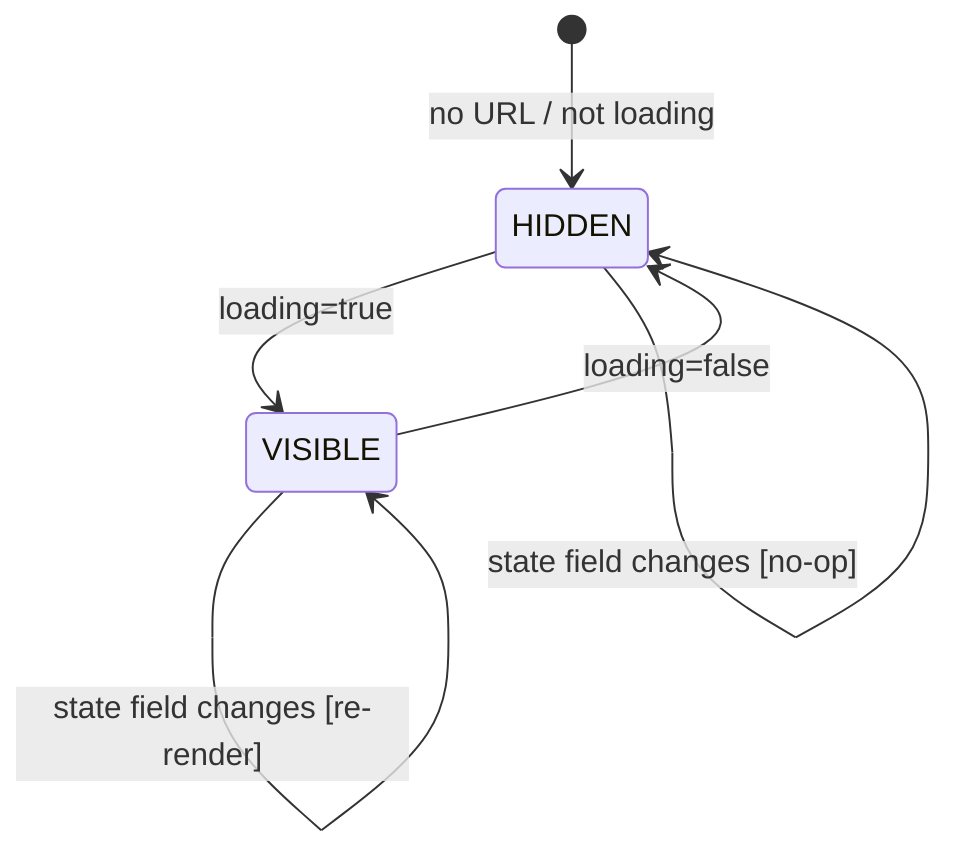

### Transition table:

| From      | To        | Trigger                          | Guard                   | Action                                        |
| --------- | --------- | -------------------------------- | ----------------------- | --------------------------------------------- |
| `HIDDEN`  | `VISIBLE` | `submitUrl()` or `onPageStarted` | `loading` becomes true  | Render `StatusOverlay` with current state.    |
| `VISIBLE` | `VISIBLE` | Any `BrowserUiState` change      | `loading` still true    | Re-render overlay with updated fields.        |
| `VISIBLE` | `HIDDEN`  | `onPageFinished` or error        | `loading` becomes false | Remove overlay; show WebView or empty prompt. |
| `HIDDEN`  | `HIDDEN`  | Theme/reader toggle while idle   | `loading` false         | No overlay; state reflected in menu/WebView.  |

---

## 6. Algorithmic Logic

### 6.1 Reader Extraction with Retry and Fallback

```mermaid
flowchart TD
    Start([Start]) --> Input[Receive state: readerRequested, readerForced, cssInjectionEnabled]
    Input --> Eligible{isReaderEligible?}
    Eligible -->|No| RestoreOriginal[restoreOriginal]
    RestoreOriginal --> ReportFalse[Bridge.onReaderApplied(false)]
    ReportFalse --> End([End])
    Eligible -->|Yes| LibsLoaded{Readability & DOMPurify loaded?}
    LibsLoaded -->|No| ReportMissing[Bridge.onReaderError(LIBRARY_MISSING)]
    ReportMissing --> RestoreOriginal
    LibsLoaded -->|Yes| Attempt[attempt = 1]
    Attempt --> Parse[article = Readability.parse(clone)]
    Parse --> Found{article valid?}
    Found -->|Yes| Sanitize[clean = DOMPurify.sanitize]
    Sanitize --> Validate{validate cleanText & interactivity}
    Validate -->|Pass| Build[build reader DOM, hide original]
    Build --> ReportTrue[Bridge.onReaderApplied(true)]
    ReportTrue --> End
    Validate -->|Fail| ReportValidation[Bridge.onReaderError(reason)]
    ReportValidation --> RestoreOriginal
    Found -->|No| MaxAttempts{attempt < MAX_ATTEMPTS?}
    MaxAttempts -->|Yes| Wait[wait 500ms]
    Wait --> Increment[attempt++]
    Increment --> Parse
    MaxAttempts -->|No| ReportNotEligible[Bridge.onReaderError(NOT_ELIGIBLE)]
    ReportNotEligible --> RestoreOriginal
```

### Algorithm details:

| Step                 | Description                                                                                                   | Constants                                      |
| -------------------- | ------------------------------------------------------------------------------------------------------------- | ---------------------------------------------- |
| `isReaderEligible`   | Check path/title heuristics and count qualifying paragraphs.                                                  | `MIN_PROSE_LENGTH = 400`, `MIN_PARAGRAPHS = 3` |
| `Readability.parse`  | Run on `document.cloneNode(true)` to avoid mutating the live DOM during extraction.                           | `MAX_ATTEMPTS = 3`, `RETRY_DELAY_MS = 500`     |
| `DOMPurify.sanitize` | Use allow-list for tags and attributes; strip `data-*` attributes.                                            | `ALLOWED_TAGS`, `ALLOWED_ATTR` as existing     |
| `validate`           | Ensure `cleanText.length >= MIN_PROSE_LENGTH` and interactive elements do not dominate paragraphs.            | interactive threshold as existing              |
| `build reader DOM`   | Create `__light_reader_root`, header, body; append to `document.body`; add `__light_reader_hidden` to `html`. | `READER_ROOT_ID`, `HIDE_CLASS`                 |

### 6.2 Status Screen Visibility

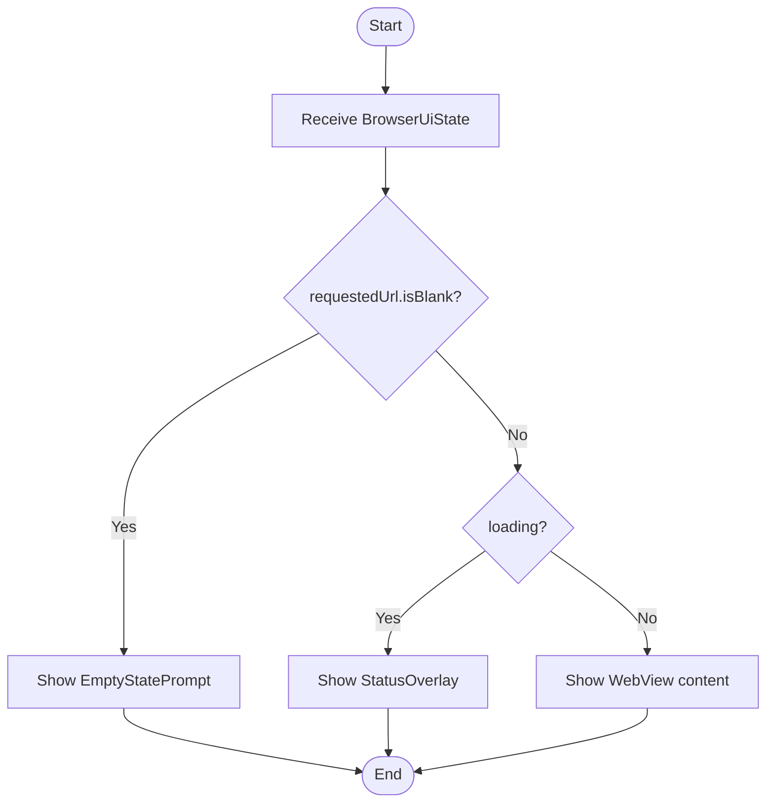

### Algorithm details:

| Step                     | Description                                                                                                                             |
| ------------------------ | --------------------------------------------------------------------------------------------------------------------------------------- |
| `requestedUrl.isBlank()` | True when no URL has been submitted.                                                                                                    |
| `EmptyStatePrompt`       | Displays centered text "Tap to open drawer" and forwards tap to `showUrlDrawer()`.                                                      |
| `StatusOverlay`          | Semi-transparent overlay listing current state fields: URL, loading, theme, readerRequested, readerApplied, cssInjectionEnabled, error. |
| `WebView`                | Shown when a URL is loaded and loading is complete.                                                                                     |

---

## 7. Exhaustive Test Matrix

### 7.1 Unit Paths

| Target                                        | Scenario            | Input                                | Expected Output                                                             | Assertion      |
| --------------------------------------------- | ------------------- | ------------------------------------ | --------------------------------------------------------------------------- | -------------- |
| `ReaderPreferences.setPageTheme`              | Persist dark        | `PageTheme.DARK`                     | DataStore contains `page_theme` = `DARK`                                    | `assertEquals` |
| `ReaderPreferences.pageTheme`                 | Load light          | DataStore `page_theme` = `LIGHT`     | `Flow` emits `PageTheme.LIGHT`                                              | `assertEquals` |
| `BrowserViewModel.setPageTheme`               | Toggle theme        | `PageTheme.DARK`                     | `uiState.pageTheme` = `DARK`                                                | `assertEquals` |
| `BrowserViewModel.onWebState`                 | Reader applied      | `WebStateUpdate(readerApplied=true)` | `uiState.readerApplied` = `true`                                            | `assertEquals` |
| `BrowserViewModel.onWebState`                 | Clear error         | `WebStateUpdate(clearError=true)`    | `uiState.error` = `null`                                                    | `assertNull`   |
| `BrowserViewModel.submitUrl`                  | Empty URL           | `""`                                 | `requestedUrl` = `""`, `loading` = `false`, `statusScreenVisible` = `false` | `assertEquals` |
| `BrowserViewModel.submitUrl`                  | Valid URL           | `"https://example.com"`              | `requestedUrl` = url, `loading` = `true`, `statusScreenVisible` = `true`    | `assertEquals` |
| `PageInjector.escapeJsString`                 | Escape quotes       | `He said "hi"`                       | `He said \"hi\"`                                                            | `assertEquals` |
| `PageInjector.escapeJsString`                 | Escape backslash    | `C:\path`                            | `C:\\path`                                                                  | `assertEquals` |
| `LightWebViewClient.shouldOverrideUrlLoading` | Block custom scheme | `intent://...`                       | Returns `true`, emits `UnsupportedScheme`                                   | `assertTrue`   |
| `LightWebViewClient.shouldOverrideUrlLoading` | Allow https         | `https://example.com`                | Returns `false`                                                             | `assertFalse`  |

### 7.2 Integration Paths

| Flow                           | Steps       | Mocked                      | Verified                                                              | Result |
| ------------------------------ | ----------- | --------------------------- | --------------------------------------------------------------------- | ------ |
| 4.1 Initial launch with no URL | 1-8         | None                        | Empty prompt shown; no WebView load                                   | Pass   |
| 4.2 Navigation with theme      | 1-18        | None                        | Theme CSS injected before `onPageFinished`; status overlay visible    | Pass   |
| 4.3 Reader success             | 1-8         | Readability returns article | Reader DOM built; `readerApplied=true` reported                       | Pass   |
| 4.3 Reader not eligible        | 1-3         | Readability returns null    | Original DOM visible; `readerApplied=false`; error reported           | Pass   |
| 4.4 Theme toggle               | 1-7         | None                        | `html.__light_dark_mode` toggled; Compose theme matches               | Pass   |
| Reload persistence             | Reload page | None                        | Theme and reader state re-applied automatically; status overlay shown | Pass   |

### 7.3 Edge Cases & Failure Modes

| Condition                     | Stimulus                        | Expected Behavior                                       | Invariant Preserved |
| ----------------------------- | ------------------------------- | ------------------------------------------------------- | ------------------- |
| No default URL                | Fresh install                   | Empty prompt shown; no network request                  | `INV-NO-DEFAULT`    |
| Submit blank URL              | User taps go with empty field   | Remain on empty prompt                                  | `INV-NO-DEFAULT`    |
| Readability library missing   | `injectReaderLibraries` skipped | `onReaderError(LIBRARY_MISSING)`; original page visible | `INV-READER-2`      |
| Parse returns null 3 times    | Lazy-loaded article             | Wait 500ms between retries; then report `NOT_ELIGIBLE`  | `INV-READER-2`      |
| Sanitized content too short   | Article is mostly navigation    | Report `TOO_SHORT`; restore original                    | `INV-READER-1`      |
| Interactive content dominates | Form-heavy article              | Report `INTERACTIVE`; restore original                  | `INV-READER-1`      |
| Exception during parse        | Malformed DOM                   | Catch exception; report `EXCEPTION`; restore original   | `INV-READER-1`      |
| Shadow-root content           | Page uses open shadow DOM       | Theme CSS injected into open shadow roots               | `INV-THEME-1`       |
| Configuration change          | Rotate device                   | WebView state restored; theme re-applied                | `INV-THEME-2`       |
| Renderer crash                | `onRenderProcessGone`           | Error surfaced; reload recreates WebView                | `INV-READER-2`      |

### 7.4 Invariant Checks

| Invariant        | Enforcement Point                                                                                    | Verification Test                     |
| ---------------- | ---------------------------------------------------------------------------------------------------- | ------------------------------------- |
| `INV-THEME-1`    | `LightWebViewClient.onPageStarted` calls `PageInjector.injectBaseStyle`                              | `testThemeInjectedBeforePageFinished` |
| `INV-THEME-2`    | `ReaderPreferences` persists theme; `LightWebViewClient` re-applies on every load                    | `testThemeSurvivesReload`             |
| `INV-READER-1`   | `restoreOriginal` always runs before any early return in `applyReaderMode`                           | `testReaderFailureRestoresOriginal`   |
| `INV-READER-2`   | `ReaderStateBridge.onReaderError` forwards to `BrowserViewModel.onWebState`                          | `testReaderErrorReported`             |
| `INV-STATE-1`    | `BrowserScreen` calls `LightWebViewClient.refreshState` from `LaunchedEffect`                        | `testStateChangeRefreshesWebView`     |
| `INV-STATE-2`    | `BrowserViewModel` is the single source of truth; JS globals are overwritten on every refresh        | `testJsGlobalsMatchViewModel`         |
| `INV-NO-DEFAULT` | `BrowserViewModel` initializes `requestedUrl` to `""` and `BrowserScreen` renders `EmptyStatePrompt` | `testNoDefaultUrl`                    |
| `INV-STATUS-1`   | `BrowserViewModel` sets `statusScreenVisible = loading` on every state change                        | `testStatusVisibleDuringLoading`      |
| `INV-STATUS-2`   | `StatusScreen` recomposes whenever `BrowserUiState` changes while `loading` is true                  | `testStatusReflectsState`             |

---

## 8. Task Dependencies

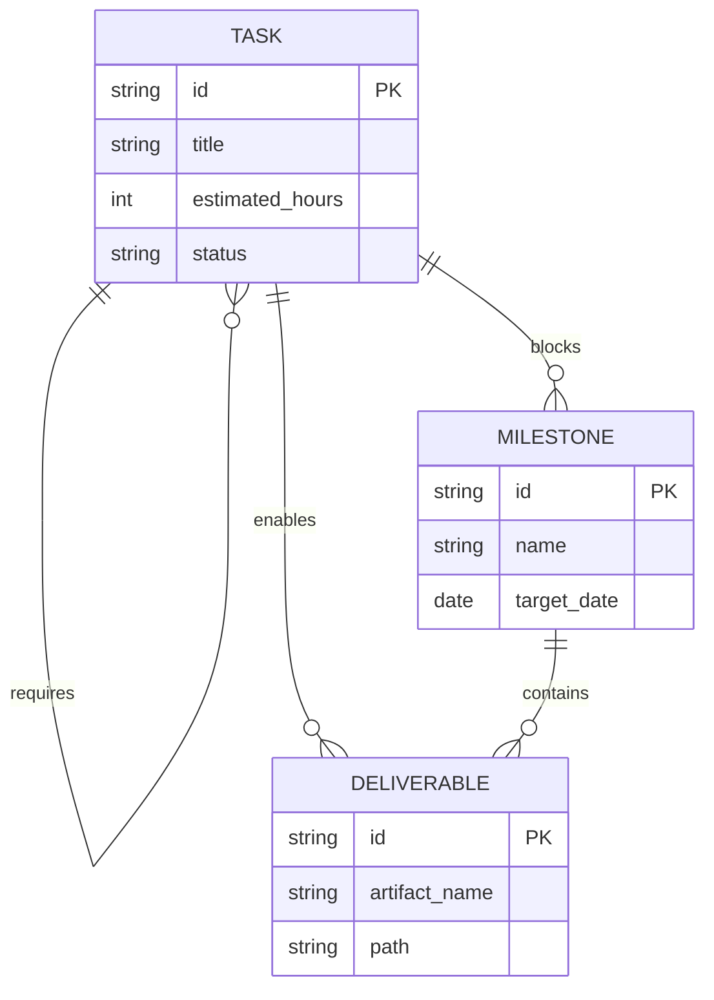

### Dependency rules:

- A `Task` with status `blocked` must have an uncompleted `requires` `Task`.
- A `Milestone` is `achievable` only when all `blocks` `Task`s are complete.
- A `Deliverable` is `available` only when all `enables` `Task`s are complete.

### Task dependency graph:

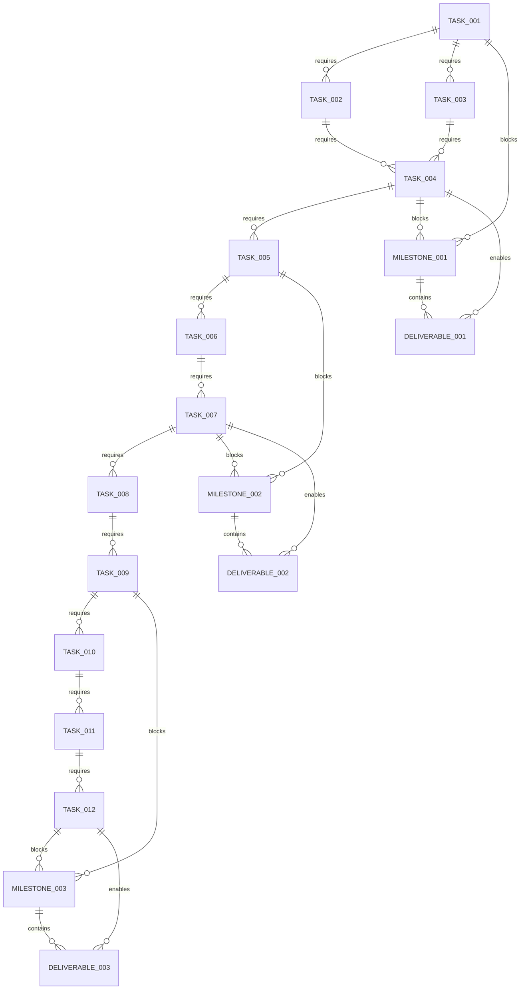

---

## 9. Implementation Timeline

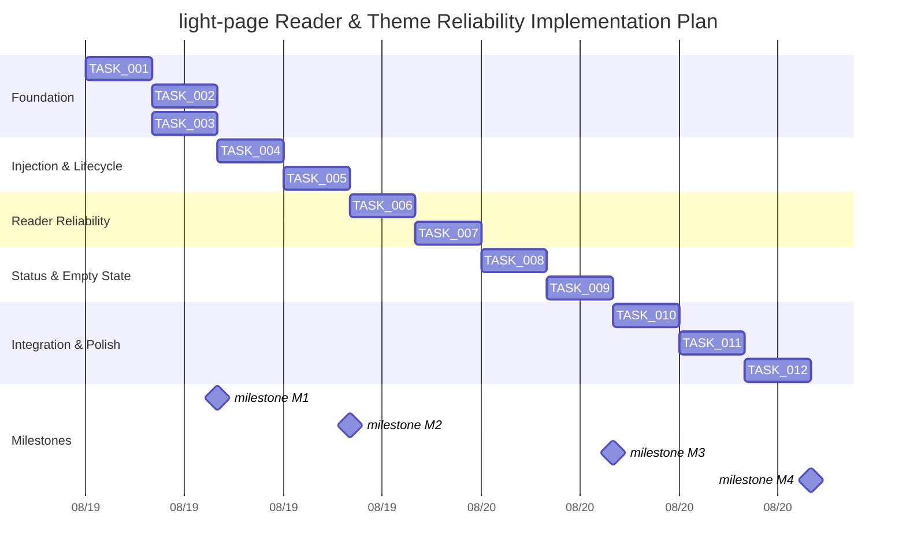

### Task list:

| ID       | Title                                                                                                                                                           | Est. Hours | Start                    | Dependencies       | Owner            |
| -------- | --------------------------------------------------------------------------------------------------------------------------------------------------------------- | ---------- | ------------------------ | ------------------ | ---------------- |
| TASK_001 | Introduce `PageTheme` enum and replace `themeInverted` in `BrowserUiState`, `ReaderPreferences`, and `BrowserViewModel`.                                        | 4          | 2026-08-19               | None               | Android dev      |
| TASK_002 | Update `BrowserScreen` to sync Compose `LightThemeController` with `PageTheme` and remove manual `applyLightGlobals`.                                           | 4          | after TASK_001           | TASK_001           | Android dev      |
| TASK_003 | Refactor `ScriptInjection` into `PageInjector` with eager asset loading and `escapeJsString` helper.                                                            | 4          | after TASK_001           | TASK_001           | Android dev      |
| TASK_004 | Move injection lifecycle into `LightWebViewClient`: `injectBaseStyle` at `onPageStarted`, libraries/hooks at `onPageFinished`, `refreshState` on state changes. | 4          | after TASK_002, TASK_003 | TASK_002, TASK_003 | Android dev      |
| TASK_005 | Add `ReaderStateBridge.onReaderError` and wire `BrowserViewModel.onWebState` to surface reader errors.                                                          | 4          | after TASK_004           | TASK_004           | Android dev      |
| TASK_006 | Rewrite `page-hooks.js` `applyReaderMode` with retry loop, structured error codes, and guaranteed `restoreOriginal` on every failure path.                      | 4          | after TASK_005           | TASK_005           | JS dev           |
| TASK_007 | Update `light-page-theme.css` to use explicit variables only, remove invert filter, and ensure shadow-root compatibility.                                       | 4          | after TASK_006           | TASK_006           | CSS dev          |
| TASK_008 | Implement `StatusScreen` with `StatusOverlay` and `EmptyStatePrompt` composables.                                                                               | 4          | after TASK_007           | TASK_007           | UI dev           |
| TASK_009 | Wire `BrowserViewModel` to set `statusScreenVisible` based on `loading` and to render empty prompt when `requestedUrl` is blank.                                | 4          | after TASK_008           | TASK_008           | Android dev      |
| TASK_010 | Add unit tests for `PageInjector`, `LightWebViewClient`, `BrowserViewModel`, `ReaderPreferences`, and `StatusScreen`.                                           | 4          | after TASK_009           | TASK_009           | QA / Android dev |
| TASK_011 | Add integration tests for navigation, theme persistence, reader success, reader failure, status visibility, and empty-state behavior.                           | 4          | after TASK_010           | TASK_010           | QA               |
| TASK_012 | End-to-end validation on real device: white flash, reload, back/forward, reader fallback, error reporting, status overlay, empty prompt.                        | 4          | after TASK_011           | TASK_011           | QA / Product     |

### Milestone definitions:

| ID            | Name                           | Target Date | Deliverable                 |
| ------------- | ------------------------------ | ----------- | --------------------------- |
| MILESTONE_001 | State Model & Injector Ready   | 2026-08-20  | `DELIVERABLE_001`           |
| MILESTONE_002 | Lifecycle & Reader Reliability | 2026-08-22  | `DELIVERABLE_002`           |
| MILESTONE_003 | Status Screen & Empty State    | 2026-08-24  | `DELIVERABLE_002` (updated) |
| MILESTONE_004 | Tested & Validated             | 2026-08-26  | `DELIVERABLE_003`           |

### Deliverable definitions:

| ID              | Artifact Name                                                     | Path                                                                        |
| --------------- | ----------------------------------------------------------------- | --------------------------------------------------------------------------- |
| DELIVERABLE_001 | Refactored Kotlin state and injection modules                     | `light-page/src/main/kotlin/com/thelightphone/lightpage/`                   |
| DELIVERABLE_002 | Updated JS/CSS assets, WebViewClient lifecycle, and status screen | `light-page/src/main/assets/` + `LightWebViewClient.kt` + `StatusScreen.kt` |
| DELIVERABLE_003 | Test suite and validation report                                  | `light-page/src/test/` + `validation-report.md`                             |

---

## 10. Revision History

| Version | Date       | Author                  | Change                                                                                                                                                                            |
| ------- | ---------- | ----------------------- | --------------------------------------------------------------------------------------------------------------------------------------------------------------------------------- |
| 1.0     | 2026-08-18 | Specification Architect | Initial specification based on repository analysis.                                                                                                                               |
| 1.1     | 2026-08-18 | Specification Architect | Added `StatusScreen` requirement, no-default-URL behavior, and updated invariants, data model, architecture, interactions, state diagrams, algorithm, tests, tasks, and timeline. |
